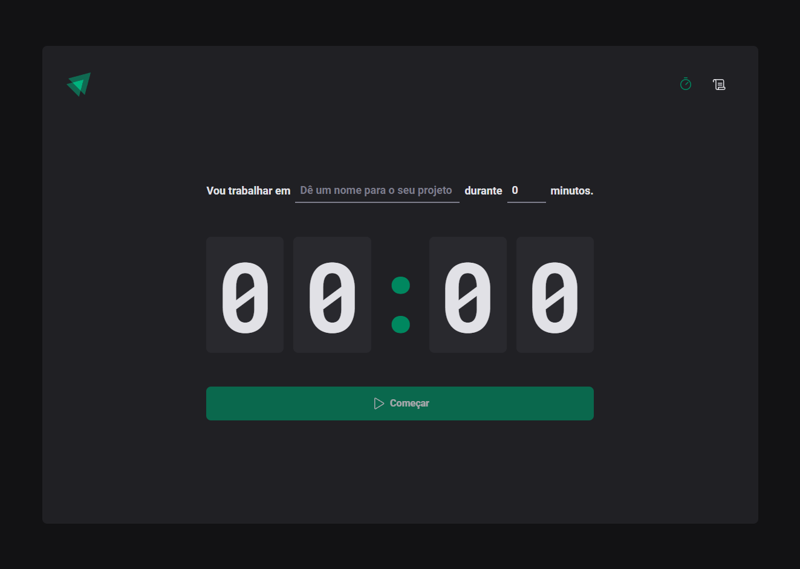
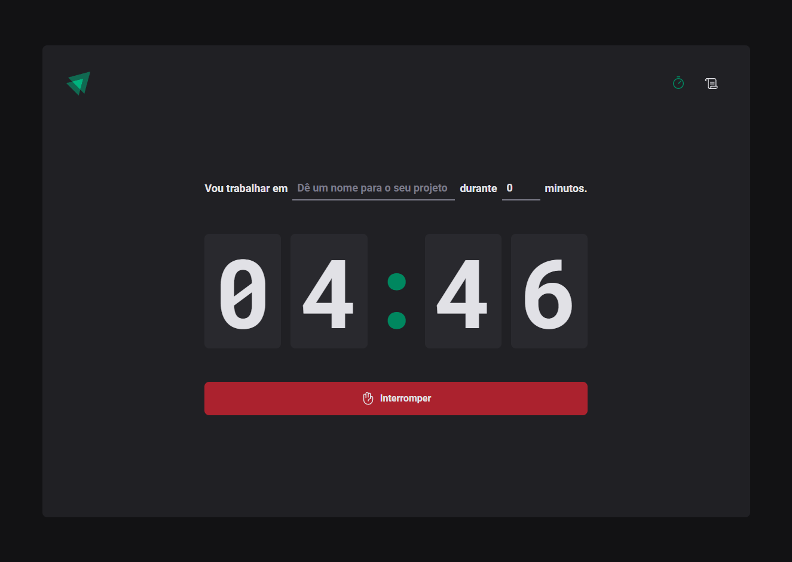
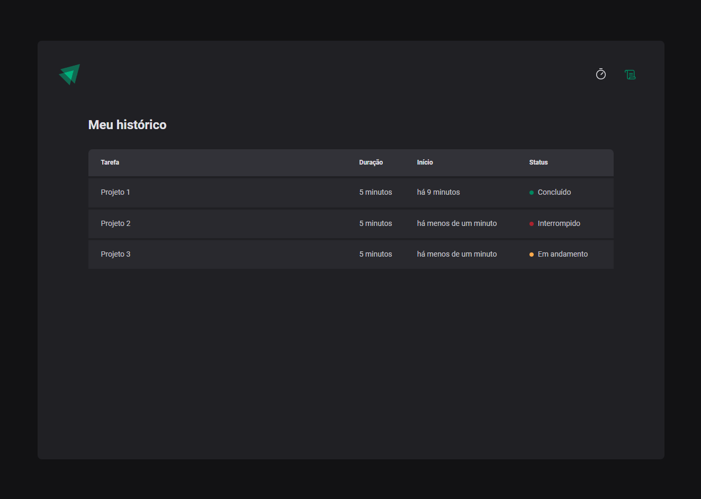

    
<h1 align="center">Ignite Timer</h1>

## Projeto
<strong>Ignite Timer</strong> é um projeto desenvolvido durante o Ignite da [Rocketseat](https://www.rocketseat.com.br/) com React utilizando diversas bibliotecas e hooks (useState, useEffect, useReducer, useContext, etc...), essa aplicação consiste em iniciar um temporizador de um determinado projeto, você pode definir o nome do projeto e o tempo em minutos de duração.

## Preview

    
    

    

## Demonstração
O projeto foi publicado no [Netlify](https://www.netlify.com/) Acesse o link: 

 - [Ignite Timer Netlify](https://shiny-chaja-9e2153.netlify.app/)

## Layout
Você pode visualizar o layout do projeto através do link abaixo:

- [Layout Web](<https://www.figma.com/file/Q7HLAepIJ2dX7rLUL7RJWc/Ignite-Timer-(Community)?node-id=0%3A1>)

## Tecnologias
Tecnologias utilizadas no projeto:
- [React](https://reactjs.org)
- [Vite](https://vitejs.dev/)
- [TypeScript](https://www.typescriptlang.org/)
- [Phosphor Icons](https://phosphoricons.com/)
- [Netlify](https://www.netlify.com/)
- [Immer](https://immerjs.github.io/immer/)
- [React Hook Form](https://react-hook-form.com/)
- [Zod](https://zod.dev/)
- [Styled Components](https://styled-components.com/)
- [ESLint](https://eslint.org/)
- [@rocketseat/eslint-config](https://www.npmjs.com/package/@rocketseat/eslint-config)